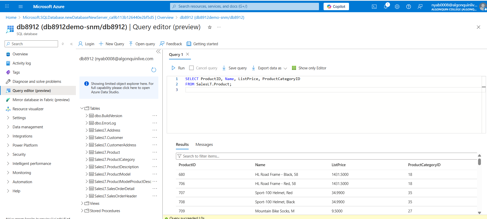

# Lab Report – CST8912 Graded Lab Activity #4
### Sandra rochelle Nyabeng Mineme- 041268641

In this lab, I explored the key features and operations of cloud-based databased and data integration using Microsoft Azure. The main objective was to understand how to deploy, configure and manage an Azure SQL Database, and then move data from database to Azure Storage using Azure Data Factory.
## 1-	Set up a cloud SQL database in Azure

 
## 2-	Use the query editor to retrieve and manipulate data
 
 
 

 
 
## 3-	Create and configure an Azure Storage Account and container to store exported data.
 
 
 
 
## 4-	Design a data pipeline in Azure Data Factory to copy data from SQL Database to Azure Blob Storage, establishing secure connections and verifying data integrity.
 
 
 
 
 

Overall, this lab reinforced my understanding of cloud service layers, the interactions between compute, storage and database services and practical data integration workflows in a cloud environment. It demonstrated how cloud platforms allow enterprises to efficiently manage databases, secure connections and transfer data at scale without managing physical infrastructure.
